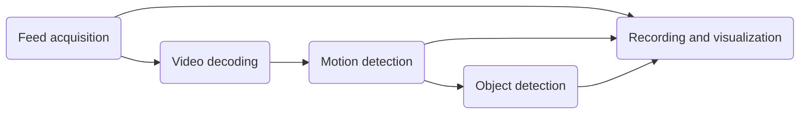
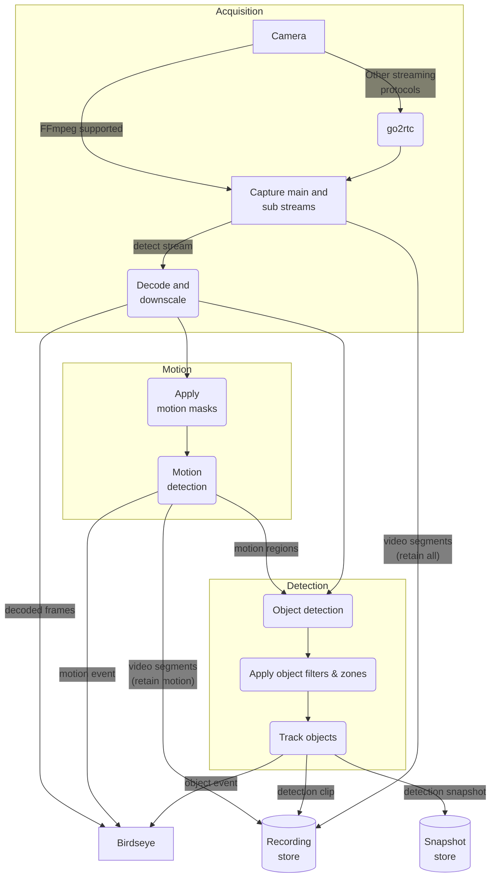

Frigate uses a sophisticated video pipeline that starts with the camera feed and progressively applies transformations to it (e.g. decoding, motion detection, etc.).

This guide provides an overview to help users understand some of the key Frigate concepts.

## Overview

At a high level, there are five processing steps that could be applied to a camera feed

As the diagram shows, all feeds first need to be acquired. Depending on the data source, it may be as simple as using FFmpeg to connect to an RTSP source via TCP or something more involved like connecting to an Apple Homekit camera using go2rtc. A single camera can produce a main (i.e. high resolution) and a sub (i.e. lower resolution) video feed.

Typically, the sub-feed will be decoded to produce full-frame images. As part of this process, the resolution may be downscaled and an image sampling frequency may be imposed (e.g. keep 5 frames per second).

These frames will then be compared over time to detect movement areas (a.k.a. motion boxes). These motion boxes are combined into motion regions and are analyzed by a machine learning model to detect known objects. Finally, the snapshot and recording retention config will decide what video clips and events should be saved.

## Detailed view of the video pipeline

The following diagram adds a lot more detail than the simple view explained before. The goal is to show the detailed data paths between the processing steps.

## Exact capture ownership for live sampling

Capture ring slots include an original frame timestamp beside their pixels.
Capture publishes both under a short nonblocking lock. Detector, tracker-frame,
and current OCR readers obtain an owned copy only when that stamp matches the
queued packet; busy, incomplete, or overwritten slots are dropped. Locks are
released before detection, OCR, or JPEG encoding, and capture never waits on a
stopped reader. This prevents a reused slot's newer pixels from being labeled
with an older packet's time.

[Live track frames](/integrations/live-tracks) and
[current LPR sampling](/configuration/license_plate_recognition#current-frame-sampling)
use this capture ownership. They do not require recordings or persisted events.
The stamped slot format changes with the paired producer/readers, so update the
whole Frigate process together; old unstamped slots are not accepted by strict
readers.

## Detector observation time

Tracked-object event payloads expose `detector_observed_at` as epoch seconds for
the real detector result that supplied the current box. It is separate from
`frame_time`: stationary refreshes can advance the tracker frame while reusing
the box. The detector clock stays unchanged for those refreshes, stationary
seeds mixed with new regional detections, and prediction-only updates. Missing
provenance remains `null`; it is never replaced with the current frame clock.

The field describes a detector measurement, not complete visibility, vehicle
identity, direction, or passage. A repeated detector clock is the same
measurement even if a later tracker event republishes it. Consumers requiring
fresh detections must validate this original clock and their own capture,
geometry and continuity bounds.

Detector IPC binds each request to a UUID stored with its input tensor under a
shared-memory lock. Workers copy only the matching generation before inference;
a queued request whose input was replaced is refused. Responses carry the same
UUID and a bounded output snapshot. Late responses cannot satisfy a later
request, and missing asynchronous outputs produce no detections. The five-second
response deadline is not extended by unrelated responses. Input locks are
released before inference; one fixed input buffer is retained per camera.

Selected cameras can enable
[vehicle detector updates](/configuration/stationary_objects#selected-camera-vehicle-detector-updates)
to redetect stopped vehicles on each processed detect frame and publish genuine
advancing detector measurements at up to 5 Hz per object. The default remains
disabled. This cadence never renews a prediction's detector clock and does not
guarantee that inference or delivery meets a consumer's freshness deadline.
